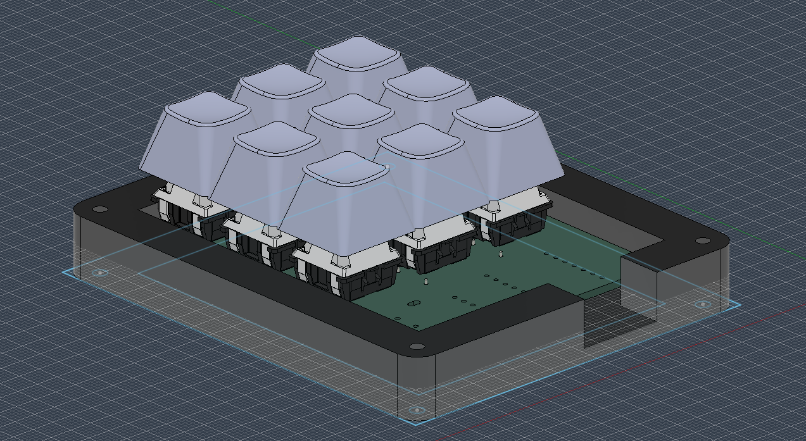
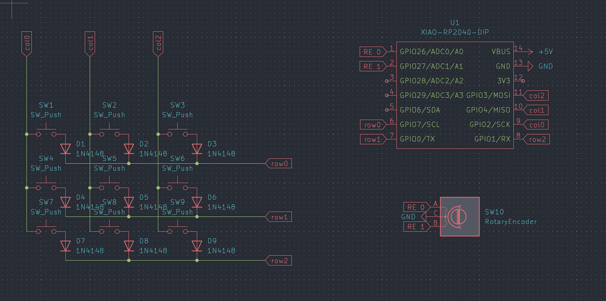
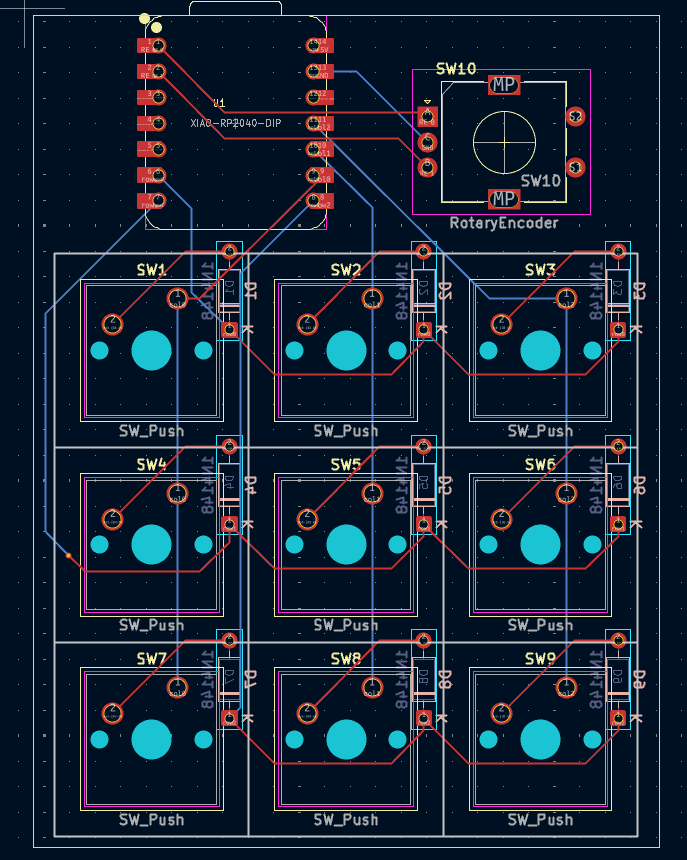
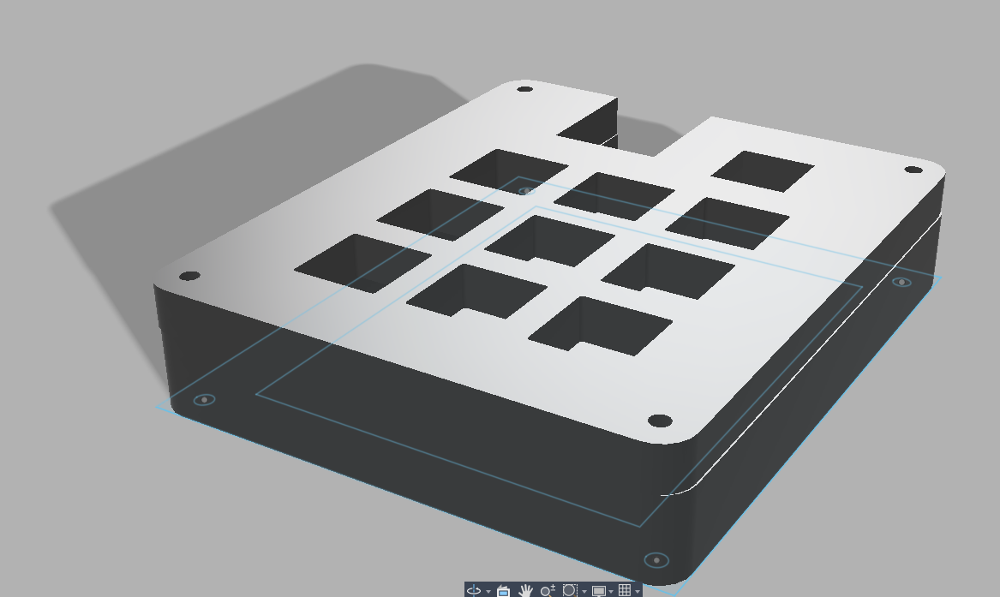
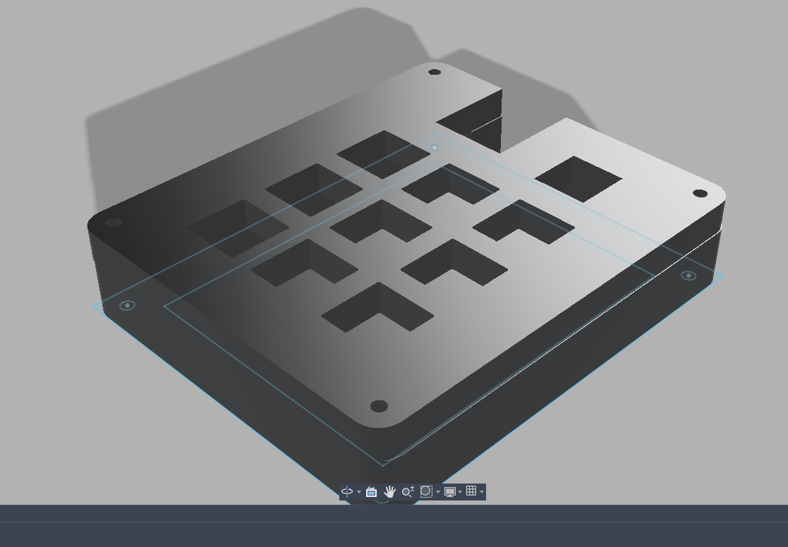
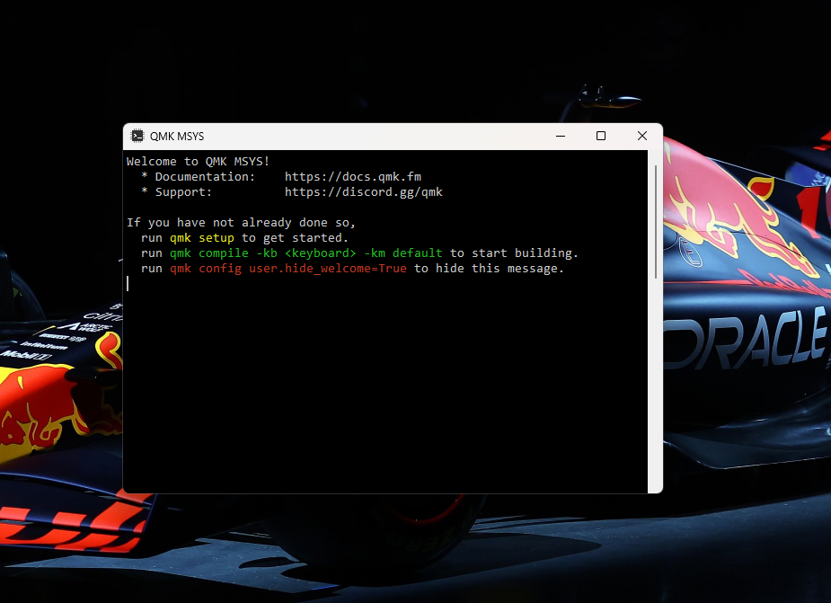

# Prv_HackPad

### Bill of Materials
 - 1x Seeed XIAO RP2040
 - 9x SW_Cherry_MX_1.00u_PCB
 - 9x Blank DSA keycaps
 - Case (from print-legion)
 - 1x Rotary Encoder

### Schematic

---

### PCB 

---

### Case
- Bottom

- Top

## Firmware
For firmware I have used QMK and it was not very easy as we can not write firmware of any hardware unless we have it physically anyways, i'm done with this!

